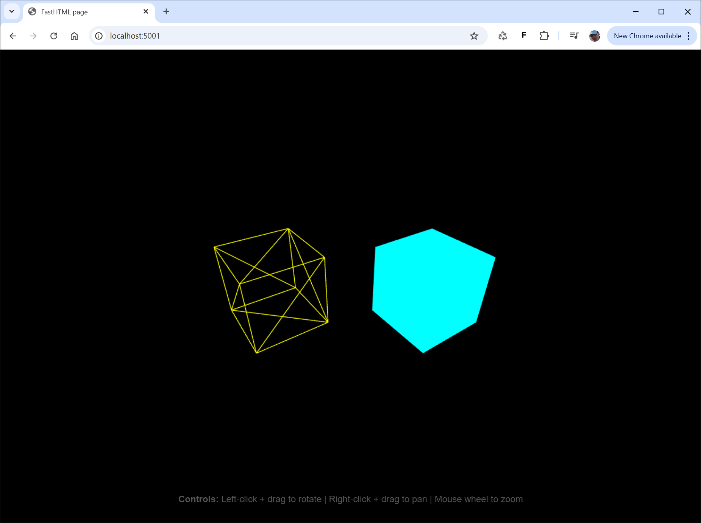

# fasthtml-threejs
A FastHTML and three.js starter kit.



# Usage

Install fasthtml.
```bash
pip install python-fasthtml
```

Clone the fh-dev-utils-examples repo:
```bash
git clone https://github.com/ExploringML/fasthtml-threejs.git
cd fasthtml-threejs
```

Run the FastHTML app and open in a browser with the url `http://localhost:5001`.
```bash
python main.py
```
